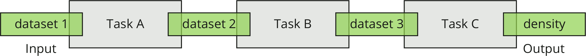
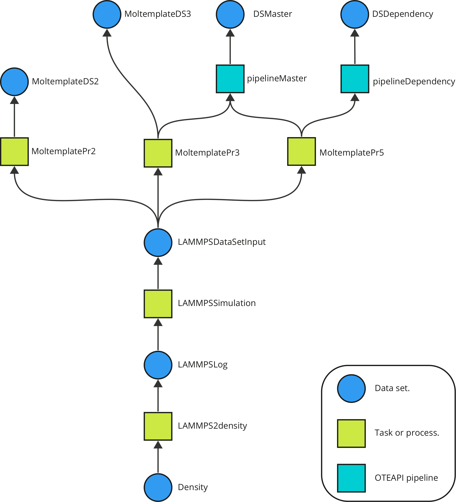
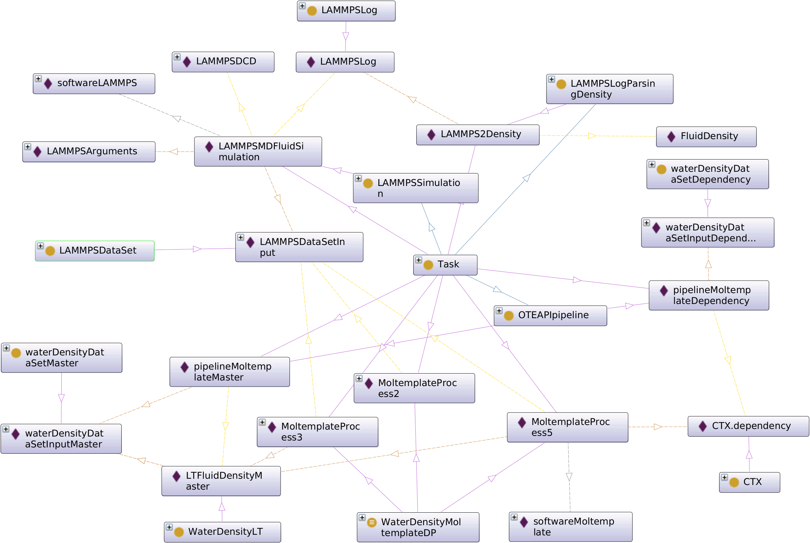

# Deliverable 5.5
The first demonstration of the OpenModel Platform uses a simple workflow consisting of three tasks connected by datasets. The merotopological representation is therefore:



The demonstration uses OntoFlow to represent each individual component and to retrieve one or more working workflows as a result of a high-level query such as "I want to know the density of a fluid". Starting from a [knowledge base](./ontoKB/individuals.ttl) describing the various tasks and their input/output datasets, OntoFlow builds a tree of all the possible workflows leading to the density of a fluid.



The output of OntoFlow is a high-level description of the executable worfklows leading to one or more solutions for an user-specified query. The conversion between the ontological representation of a workflow and its serialisation in the YAML format (i.e. the declarative workflow syntax used in ExecFlow) is out of the scope of this demonstration and will be addressed in a future deliverable. Machine-executable scripts describing the three solutions identified by OntoFlow are provided for execution in AiiDA, thus demonstrating the use of ExecFlow and OTEAPI pipelines for the execution of a physics-based simulation.

### Installing the OpenModel software stack

The local execution of this demonstration requires the following software components, which are the core OpenModel software stack.

* The original instructions to set up a working AiiDA environment can be found at the following [link](https://aiida.readthedocs.io/projects/aiida-core/en/latest/intro/get_started.html). Please refer to the official AiiDA documentation for troubleshooting. Here we report  the steps to perform a system-wide installation on a Debian/Ubuntu OS. Open a terminal and execute:

  ```bash
  sudo apt install git python3-dev python3-pip postgresql postgresql-server-dev-all postgresql-client rabbitmq-server
  ```

  To avoid clash with locally installed libraries (e.g. VMD), modify the file `$HOME/envs/aiida/bin/activate` by adding the following line:

  ```bash
  export LD_LIBRARY_PATH=""
  ```

  Then (from AiiDA instructions):

  ```bash
  python -m venv ~/envs/aiida
  (aiida) verdi quicksetup
  (aiida) verdi daemon start 2
  ```

* Install [Moltemplate](http://www.moltemplate.org/download.html):

  * `git clone https://github.com/jewettaij/moltemplate moltemplate `

  * Add the following lines to `~/.bashrc`:

    ```bash
    export PATH="$PATH:/path/to/moltemplate/moltemplate"
    export PATH="$PATH:/path/to/moltemplate/moltemplate/scripts"
    ```

  * There are also alternative ways of installing Moltemplate, e.g. through `pip`. See the `INSTALL.md` file in the Moltemplate repo.

* Install [LAMMPS](https://lammps.org).
  The easiest option is to download a [static linux binary](https://download.lammps.org/static/). Alternatively, it can be compiled from the source code using `make` or `cmake` following the instructions [here](https://docs.lammps.org/Install.html). Note that the LAMMPS binary in the YAML scripts is called `lmp_23Jun22`. You can either create a symbolic link with that name to any other valid LAMMPS binary file, or replace the string `command: "lmp_23Jun22"` in the files [`workflow_nopipes.yaml`](./demo1/workflow_nopipes.yaml), [`workflow_1oteapi.yaml`](./demo1/workflow_1oteapi.yaml), and [`workflow_2oteapi.yaml`](./demo1/workflow_2oteapi.yaml) with the name of your local LAMMPS binary.


* Clone the [OpenModel Public](https://github.com/H2020-OpenModel/Public) repository and install the python modules including `ontoflow` and `execflow`. Open a terminal and execute:
  ```bash
  git clone https://github.com/H2020-OpenModel/Public.git
  cd Public/Deliverable5.5
  pip install .
  ```
NB! Until ExecFlow and OntoFlow have been made public it might be easier to just clone and pip install execflow and ontoflow separately before the step above.

  To avoid changing the names of local files stored in the repository, absolute paths with root `/tmp/Public` have been used. Independently from where your repository is stored, create the following link from a terminal:
  
  ```bash
  cd /tmp
  ln -s /path/to/Public
  ```

> TODO: 
>
> * Replace the dependencies in `pyproject.toml` once those components will be released publicly.


### The OpenModel domain ontology

The semantic representation of materials modelling workflows, data, and computational methods is based on a domain ontology developed using [EMMO v1.0.0-beta5](https://github.com/emmo-repo/EMMO/tree/1.0.0-beta5) as top reference. A graphical representation of the knowledge base displaying some of the tasks forming the demo workflow 1 is shown below:



A simple query to the OntoKB is presented in the file [`application.py`](./ontoKB/application.py). Basically, the user asks for any route leading to the computation of the density of a fluid, expressed by the ontological class with IRI `http://emmo.info/emmo#FluidDensity`. From a terminal, execute:

```bash
cd Public/Deliverable5.5/ontoKB 
python application.py
```

> TODO: 
>
> * describe the OpenModel ontology and OntoKB, i.e. how the workflow is described and stored in a triplestore. Is there a better way to create a KB other than using Protégé?
> * Verify that a query can be made locally using a free version of StarDog.

### ExecFlow demonstration

Once the software is installed locally, start the AiiDA environment and the Verdi daemon. Open a terminal and execute:

```bash
source ~/envs/aiida/bin/activate
verdi daemon start
```

The three workflows are executed from the AiiDA prompt with `verdi` running in the background:

```bash
cd /path/to/Public/Deliverable5.5/demo1
python run_workflow.py workflow_nopipes.yaml
python run_workflow_pipes.py workflow_1oteapi.yaml
python run_workflow_pipes.py workflow_2oteapi.yaml
```

The workflow execution is inspected with the commands:

```bash
verdi process list -a
verdi node show 5601
verdi node attributes 5601
```

### List of directories

* [demo1/](./demo1) Files and data to run the demo number 1.
* [entities/](./entities) Data models for the input datasets.
* [execflowdemo/](./execflowdemo) Additional software used in this demonstration, e.g. a simple LAMMPS parser extracting the density.
* [ontoKB/](./ontoKB) OpenModel domain ontology and knowledge base for demo number 1.

