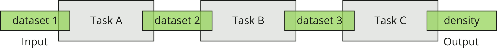
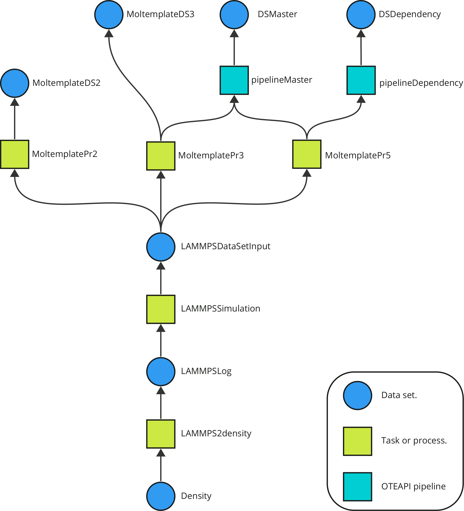

# Public
Archive of public deliverables, files, and demonstrations of the OpenModel project.

## Deliverable 5.5

The first demonstration of the OpenModel Platform uses a simple workflow consisting of three tasks connected by datasets. The merotopological representation is therefore:



The demonstration uses OntoFlow to represent each individual component and to retrieve one or more working workflows as a result of a high-level query such as "I want to know the density of a fluid". Starting from a [knowledge base](Deliverable5.5/ontoKB/individuals.ttl) describing the various tasks and their input/output datasets, OntoFlow builds a tree of all the possible workflows leading to the density of a fluid.



The output of OntoFlow is a high-level description of the executable worfklows leading to a solution for an user-specified query. The conversion between the ontological representation of a workflow and its serialisation in the YAML format (i.e. the declarative workflow syntax used in ExecFlow) is out of the scope of this demonstration and will be addressed in a future deliverable.

### The OpenModel domain ontology

The semantic representation of materials modelling workflows, data, and computational methods is based on a domain ontology developed using [EMMO v1.0.0-beta5](https://github.com/emmo-repo/EMMO/tree/1.0.0-beta5) as top reference. A graphical representation of the knowledge base storing some of the tasks forming the demo workflow 1 is shown below:


> TODO: 
>
> * describe the OpenModel ontology and OntoKB, i.e. how the workflow is described and stored in a triplestore. Is there a better way to create a KB other than using Protégé?
> * How to make a query? Can it be done locally? (e.g. using a free version of StarDog).

### Installing the OpenModel software

The local execution of this demonstration using ExecFlow requires the following software components.

* Setting up a working AiiDA environment: [link](https://aiida.readthedocs.io/projects/aiida-core/en/latest/intro/get_started.html). Recommended: system-wide installation without CONDA. Begin by installing the following packages:

  ```bash
  sudo apt install git python3-dev python3-pip postgresql postgresql-server-dev-all postgresql-client rabbitmq-server
  ```

  To avoid clash with locally installed libraries (e.g. VMD), modify the file `$HOME/envs/aiida/bin/activate` by adding the following line:

  ```bash
  export LD_LIBRARY_PATH=""
  ```

  Then (from AiiDA instructions):

  ```bash
  $ python -m venv ~/envs/aiida
  (aiida) $ verdi quicksetup
  (aiida) $ verdi daemon start 2
  ```

* Install [Moltemplate](http://www.moltemplate.org/download.html):

  * `git clone https://github.com/jewettaij/moltemplate moltemplate `

  * Add the following lines to `~/.bashrc`:

    ```bash
    export PATH="$PATH:/path/to/moltemplate/moltemplate"
    export PATH="$PATH:/path/to/moltemplate/moltemplate/scripts"
    ```

  * There are also alternative ways of installing Moltemplate, e.g. through `pip`. See the `INSTALL.md` file in the Moltemplate repo.

* Install LAMMPS. The easiest option is to download a [static linux binary](https://download.lammps.org/static/). Alternatively, it can be compiled from the source code using `make` or `cmake`. Follow the instructions [here](https://docs.lammps.org/Install.html).

* Start the AiiDA environment and the Verdi daemon.

  ```bash
  source ~/envs/aiida/bin/activate
  verdi daemon start
  ```

* Clone the [ExecFlow repo](https://github.com/H2020-OpenModel/ExecFlow) and install the plugin with `pip`:

  ```bash
  pip install -e .
  ```

  Do the same for [oteapi-dlite](https://github.com/EMMC-ASBL/oteapi-dlite).

> TODO: 
>
> * Replace these steps with a `pip` installation, once those components will be released publicly.
>

### Execute the workflow

Clone the [OpenModel Public](https://github.com/H2020-OpenModel/Public) repository and install the local components for AiiDA (e.g. a `calcjob` to parse a molecular dynamics output file) . From a terminal, execute:

```bash
git clone https://github.com/H2020-OpenModel/Public.git
cd Public/Deliverable5.5
pip install .
```

To avoid changing the names of local files stored in the repository, absolute paths with root `/tmp/Deliverable5.5` have been used. Independently from where your repository is stored, create the following link from a terminal:

```bash
cd /tmp
ln -s /path/to/Public/Deliverable5.5
```

Note that the LAMMPS executable in the script is called `lmp_23Jun22`. You can create a symbolic link with that name to any other valid LAMMPS binary file, or replace the string `command: "lmp_23Jun22"` in the YAML files with the name of your local LAMMPS binary.

The workflow is executed from the AiiDA shell with `verdi` running:

```bash
cd /path/to/Public/Deliverable5.5/demo1
python run_workflow.py workflow_nopipes.yaml
python run_workflow_pipes.py workflow_1oteapi.yaml
python run_workflow_pipes.py workflow_2oteapi.yaml
```

The workflow execution is inspected with the commands:

```bash
verdi process list -a
verdi node show 5601
verdi node attributes 5601
```

### List of directories

* [demo1/](./Deliverable5.5/demo1) Files and data to run the demo number 1.
* [entities/](./Deliverable5.5/entities) Data models for the input datasets.
* [execflowdemo/](./Deliverable5.5/execflowdemo) Additional software used in this demonstration, e.g. a simple LAMMPS parser extracting the density.
* [ontoKB/](./Deliverable5.5/ontoKB) OpenModel domain ontology and knowledge base for demo number 1.

